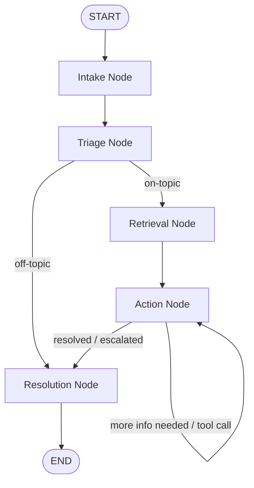

# Stateful AI Customer Service Agent

A high-performance, scenario-based AI Customer Service Agent portfolio demonstrating stateful multi-turn customer support, Standard Operating Procedure (SOP) compliance, and a real-time compliance evaluation engine.

---

## 🎯 Architecture & Execution Flow

The core system is orchestrating conversation state through a **stateful graph (LangGraph)**. Below is the technical node routing structure:



### Flow Walkthrough
1. **Intake Node**: Appends the latest customer message (or callback payload) to the `AgentState`.
2. **Triage Node**: Classifies the customer query into one of five intents: `product_troubleshooting`, `account_access`, `feature_request`, `general_inquiry`, or `off-topic`. 
   - **Security Guardrail**: Implements prompt-injection checks and flags out-of-boundary requests as `off-topic` to prevent model instruction hijacking.
3. **Retrieval Node**: Computes a local vector embedding of the user query and searches the database for relevant SOP chunks.
4. **Action Node**: Ingests the retrieved SOP context and reasons over the history to generate the next response. It strictly adheres to guideline directives (no hallucinated steps, one inquiry at a time, or triggering mock tools).
5. **Resolution Node**: Terminates the active conversation turn, delivering the resolved response or recording a ticket transfer/escalation.

---

## ⚙️ The Tech Stack

### 1. Frontend
* **Core**: React 18, Vite, TypeScript.
* **Styling**: Tailwind CSS, shadcn/ui.
* **Features**: Live multi-scenario tenant switcher, guest-session isolation, and a slider drawer for the Real-time Compliance Panel.

### 2. Backend (FastAPI)
* **Orchestration**: LangGraph (`StateGraph`), LangChain.
* **LLM Engine**: Groq API (`llama-3.3-70b-versatile` by default, fully configurable via `GROQ_MODEL` environment variable).
* **Local Embeddings**: `SentenceTransformer('all-MiniLM-L6-v2')` cached locally on the backend.
* **State Management**: Transient session history handled by LangGraph memory saver.

### 3. Database (Supabase)
* **Engine**: PostgreSQL with the `pgvector` extension enabled.
* **Context Retrieval**: A vector similarity RPC function (`match_document_chunks`) matching query embeddings against embedded SOP segments, segmented by `tenant_id` to enforce tenant isolation.

---

## 🛡️ Asynchronous Compliance Evaluator

To enforce compliance auditing without adding latency to the client response, the backend triggers an **asynchronous evaluator** after every message using a FastAPI background task:

```
[Agent Response Delivered]
          │
          ▼
┌─────────────────────────────────┐
│  FastAPI Background Task        │
│  (Evaluator Node - Llama 3)     │
└────────────────┬────────────────┘
                 │
                 ▼
 ┌───────────────┴───────────────┐
 │ • Adherence Score (0-100)     │
 │ • Policy Violations List      │
 │ • Tone Analysis (Pass/Fail)   │
 │ • Hallucination Flag          │
 └───────────────┬───────────────┘
                 │
                 ▼
┌─────────────────────────────────┐
│ Store in message_evaluations    │
│ table (Supabase)                │
└─────────────────────────────────┘
```

* **SOP Adherence Score**: Computes a numerical rating based on guidelines followed.
* **Policy Violations**: Formulates a detailed list of policy breaches.
* **Tone & Style**: Ensures the tone matches the scenario's brand guidelines.
* **Hallucination Detection**: Flags statements or rules declared by the agent that cannot be proven by the retrieved context.

The results are displayed instantly in the frontend's **Compliance Panel** tab for auditing.

---

## 🔐 Session & Tenant Isolation
* **Tenant Isolation**: Pre-seeded database entries are separated by `tenant_id` (e.g. `ecommerce_demo`, `creditcard_demo`, `internet_demo`, `elearning_demo`). Every document search strictly filters by the active tenant ID to prevent cross-leakage.
* **Guest Isolation**: Visitors login anonymously with a transient guest token. Messages are stored and queried using the guest's unique ID to ensure complete history isolation.

---

## 🛠️ Development & Commands

### Prerequisites
* Conda environment (`refero-env`)
* Groq API Key (`GROQ_API_KEY`)
* Supabase Credentials (`SUPABASE_URL` and `SUPABASE_SERVICE_ROLE_KEY` / `VITE_SUPABASE_PUBLISHABLE_DEFAULT_KEY`)

### Running the Services

#### 1. Backend (FastAPI)
Run the dev server:
```bash
python run_backend.py
```
By default, the API will be available at `http://localhost:8000`.

#### 2. Frontend (Vite)
Install dependencies and run:
```bash
npm install
npm run dev
```

### Running Tests
All logic, routers, and evaluator nodes are covered by `pytest`:
* **Full test suite**: `pytest api/tests -q`
* **Single test suite (evaluations)**: `pytest api/tests/test_http_endpoints.py -q`
