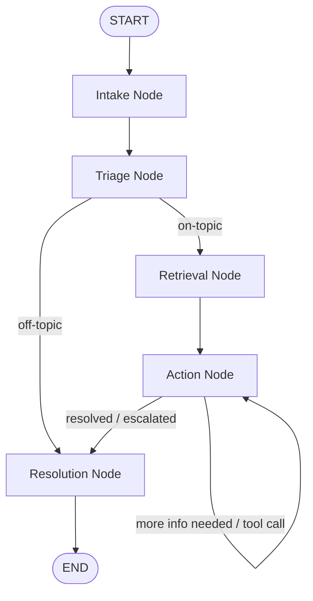

# Customer Service Agent Architecture

## Overview
The Customer Service Agent is built as a stateful graph (using LangGraph). It acts as a Tier 1 support agent that strictly adheres to Standard Operating Procedures (SOPs). 

This project is structured as a **portfolio website** showcasing the agent's capabilities in 4 distinct scenarios:
1. **E-Commerce Support**
2. **Credit Card Disputes**
3. **Internet Provider Troubleshooting**
4. **E-Learning Platform Support**

Visitors can interact with the agent directly in a guest-authenticated chat interface. There is no administrative SOP upload; all SOP policies are pre-seeded in the database during development/deployment.

## Core Workflow (Graph Nodes)

The agent operates in a continuous loop until the issue is resolved or escalated.

### 1. Intake Node
*   **Purpose:** Receives the customer's message (initial query or follow-up response).
*   **Functionality:** Updates the conversation state with the latest message.

### 2. Triage Node
*   **Purpose:** Classifies the user's intent and enforces safety guardrails.
*   **Intents:** `product_troubleshooting`, `account_access`, `feature_request`, `general_inquiry`, `off-topic`.
*   **Security & Guardrails:**
    *   Evaluates the message for prompt injection or system game-playing.
    *   Flags inputs completely unrelated to the active business scenario as `off-topic`.
*   **Output:** The classified intent, routing the flow to the Retrieval Node or directly to Resolution (for off-topic messages).

### 3. Retrieval Node
*   **Purpose:** Fetches relevant SOP chunks using vector similarity search.
*   **Functionality:**
    *   Generates a vector embedding of the user's query using a local/free sentence transformer model (`all-MiniLM-L6-v2`).
    *   Queries `supabase` using `pgvector` to perform similarity search, filtered by the active demo's `tenant_id` to prevent cross-scenario data leakage.

### 4. Action Node
*   **Purpose:** Reasons over the retrieved SOP context using Gemini 1.5 Pro to decide the next response or action.
*   **Functionality:**
    *   Determines if more information is required from the customer.
    *   Binds tools dynamically based on the active scenario (e.g., mock tools like tracking orders, checking system status, or initiating fee waivers).
    *   Adheres strictly to the pre-seeded SOP without inventing steps.

### 5. Resolution / Escalation Node
*   **Purpose:** Closes the chat turn or transfers the customer.
*   **Functionality:**
    *   **Resolution:** Closes the interaction when the query has been successfully resolved according to policy.
    *   **Escalation:** If the policy dictates human escalation, it transfers the conversation state to a mock escalation ticket.

## State Management
The graph maintains a state object (`AgentState`) containing:
*   `messages`: The conversation message history.
*   `tenant_id`: Identifies the selected scenario (`ecommerce_demo`, `creditcard_demo`, `internet_demo`, or `elearning_demo`).
*   `current_intent`: The latest classified intent.
*   `retrieved_context`: Relevant SOP passages retrieved from the vector database.
*   `collected_info`: Structured values gathered during conversation steps (e.g., emails, transaction numbers).
