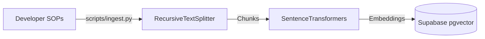

# Ingestion Strategy and Vector Store

## Overview
A key feature of the Customer Service Agent is its domain adaptability. Transitioning the agent between different industries is as simple as updating its Standard Operating Procedure (SOP) documents and updating the business profile configuration.

In this portfolio website implementation, document ingestion is designed as a **build-time/deployment seeding script** rather than a dynamic user upload system. This ensures the demo scenarios are preloaded and ready for immediate testing.

## Pipeline Architecture



### 1. Document Source
*   Mock SOPs for the 4 scenarios are authored by developers and stored as Markdown files in the `policy_documents/` folder.
*   The 4 files are:
    1. `policy_documents/ecommerce_sop.md`
    2. `policy_documents/creditcard_sop.md`
    3. `policy_documents/internet_sop.md`
    4. `policy_documents/elearning_sop.md`

### 2. Parsing & Chunking
*   **Recursive Splitter:** The ingestion pipeline uses LangChain's `RecursiveCharacterTextSplitter` to partition documents.
*   **Parameters:** Split size is set to 500 characters with an overlap of 50 characters to ensure content coherence at chunk boundaries.
*   **Metadata Tagging:** Each chunk is tagged with:
    *   `document_id`: The ID of the parent document.
    *   `tenant_id`: The business profile scenario ID (`ecommerce_demo`, `creditcard_demo`, `internet_demo`, or `elearning_demo`).

### 3. Embedding Generation
*   **Model:** We use HuggingFace's `all-MiniLM-L6-v2` model (run locally using the `sentence-transformers` library).
*   **Dimensions:** It produces 384-dimensional dense vectors.
*   **Cost:** Running this model locally is free and has zero runtime API dependency.

### 4. Vector Database (Supabase pgvector)
*   Embeddings and text chunks are stored in Supabase under the `document_chunks` table.
*   Retrieval is performed using cosine similarity queries filtered by the target scenario's `tenant_id` to ensure absolute isolation between scenarios.

## Ingestion Command
To re-run the seeding pipeline (e.g. after modifying the mock SOP markdown files):
```bash
python scripts/ingest.py --force
```

The script:
1. Creates or updates the 4 demo business records in the `businesses` table.
2. Deletes existing chunks/documents for modified files.
3. Reads the Markdown files in `policy_documents/`.
4. Chunks, embeds, and saves them to Supabase.
5. Saves file MD5 hashes to `scripts/.ingest_hashes.json` to prevent re-ingesting unmodified files.
